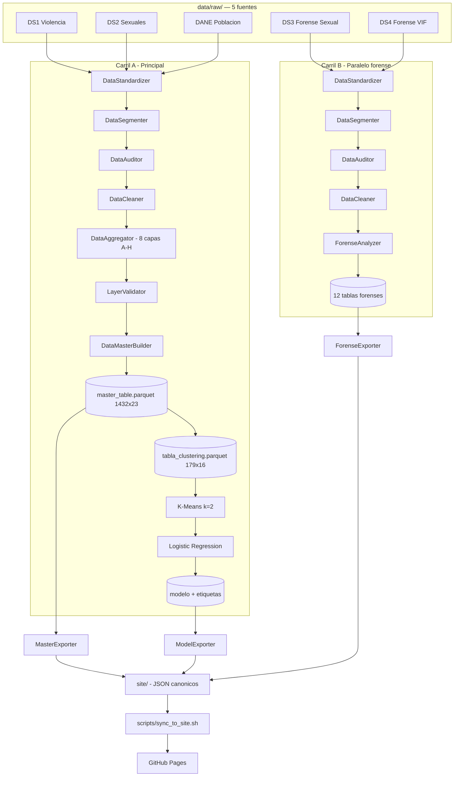
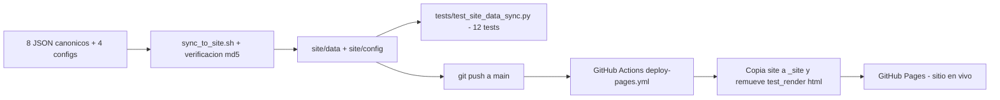

# Arquitectura

*Cicatrices Invisibles* se organiza en **dos carriles paralelos que nunca se cruzan**, más una etapa de despliegue que los une únicamente a nivel de presentación (dashboard). Ver el detalle metodológico completo en [`marco_metodologico.md`](marco_metodologico.md).

## Principio rector: dos carriles, dos productos

- **Carril A (Principal):** DS1 + DS2 + DANE → 8 capas analíticas → tabla maestra territorial → **ICV-GEN-F** → **K-Means**. Es el único carril que alimenta el índice y el modelo de IA.
- **Carril B (Paralelo / forense):** DS3 + DS4 → **ForenseAnalyzer** → 12 tablas de caracterización. Alimenta exclusivamente el dashboard (perfil del agresor, escenario, interseccionalidad). **Nunca se une a la tabla maestra ni al modelo.**

Ambos carriles comparten los mismos módulos de ingesta y limpieza (`DataStandardizer`, `DataSegmenter`, `DataAuditor`, `DataCleaner`), pero se ejecutan de forma independiente y producen artefactos separados.

## Diagrama del pipeline

## Las 11 etapas del pipeline

| # | Etapa | Módulo | Salida |
| :---- | :---- | :---- | :---- |
| 0 | Configuración externa | `mapping_config.json` | Reglas de negocio centralizadas |
| 1 | Ingesta pura | `DataLoader` | 5 DataFrames crudos en RAM |
| 2 | Fotografía estructural | `MetadataMapper` | `docs/mapeo_estructural_raw.csv` |
| 3 | Estandarización vectorial | `DataStandardizer` | 5 DataFrames canónicos |
| 4 | Segmentación territorial/temporal | `DataSegmenter` | `data/segmented/*.parquet` |
| 5 | Auditoría de calidad | `DataAuditor` | `docs/auditoria_{dataset}.csv` |
| 6 | Limpieza | `DataCleaner` | `data/cleaned/*_limpio.parquet` |
| 7 | Capas analíticas | `DataAggregator` | 8 capas A–H en RAM |
| 8 | Validación cruzada | `LayerValidator` | `docs/validacion_capas_pre_join.csv` |
| 9 | Tabla maestra | `DataMasterBuilder` | `maestro_concurso.parquet` + `tabla_clustering.parquet` |
| 10 (paralelo) | Caracterización forense | `ForenseAnalyzer` | 12 tablas en `data/agregados_forense/` y `data/agregados_seforense/` |
| 11 | Modelado | K-Means + Logistic Regression (`03_ml_entrenamiento.ipynb`) | `tabla_clustering_final.parquet` + `models/` |

**Principio no negociable:** cada etapa tiene una única responsabilidad. `DataAuditor` observa, nunca transforma. `DataCleaner` no genera dimensiones ni calcula tasas. `DataMasterBuilder` es el único punto donde se calculan tasas, brechas e ICV-GEN-F.

## Arquitectura de configuración externa

Ninguna regla de negocio vive en el código Python. Todo lo que puede cambiar entre una corrida y otra — la región, el período, los pesos del ICV-GEN-F, las taxonomías de agresor/escenario — está en archivos JSON:

| Config | Usado por | Contenido |
| :---- | :---- | :---- |
| `mapping_config.json` | Etapas 1–6 | Alias de columnas, taxonomías, reglas de tipo, normalización |
| `master_builder_config.json` | Etapas 7–9 | Pesos del ICV-GEN-F, definición de capas, reglas de validación |
| `forense_analyzer_config.json` | Etapa 10 | Definición de las 12 tablas forenses (Carril B) |
| `ml_config.json` | Etapa 11 | Hiperparámetros de K-Means y del clasificador |
| `municipios_pacifico.json` | Etapas 3, 4 | Referencia geográfica DANE/DIVIPOLA (179 municipios) |
| `master_exporter_config.json` / `forense_exporter_config.json` | Exportación | Mapeo de columnas a exportar por módulo del dashboard |

Un auditor puede revisar cualquier regla metodológica leyendo JSON, sin necesidad de leer Python.

## Arquitectura de despliegue

El sitio es 100% estático — sin backend, sin base de datos, sin contenedor — servido desde GitHub Pages con Leaflet (mapas coropléticos) y Apache ECharts (gráficos interactivos).

`site/` es un artefacto autocontenible: incluye sus propias copias de datos y configuración, nunca se edita a mano (se regenera con `scripts/sync_to_site.sh`), y su paridad con las fuentes canónicas está protegida por 12 tests dedicados. El workflow de GitHub Actions remueve los `test_render_*.html` antes de publicar, de modo que el jurado solo ve el dashboard final.

## Stack tecnológico

| Capa | Tecnología |
| :---- | :---- |
| Pipeline de datos | Python (pandas, scikit-learn), Parquet + Snappy |
| Modelado | K-Means, Logistic Regression (scikit-learn) |
| Frontend | HTML/CSS/JS vanilla (sin framework) |
| Visualización | Leaflet 1.9.4 (mapas), Apache ECharts 6.0.0 (gráficos) |
| Hosting | GitHub Pages, desplegado vía GitHub Actions |
| Testing | pytest — 94 tests (82 backend + 12 de sincronización) |
| Desarrollo asistido por IA | Claude Code — vibecoding del frontend, bajo revisión y confirmación del equipo en cada paso |

## Por qué un sitio estático y no Streamlit/Dash

1. **Rendimiento:** carga instantánea desde CDN, sin *cold starts* de servidor.
2. **Estética y control:** diseño propio, sin las limitaciones visuales de un framework de dashboards.
3. **Separación de capas:** el pipeline Python está completamente desacoplado del frontend — el JavaScript solo renderiza, toda la lógica de negocio vive en Python y se exporta ya pre-agregada.
